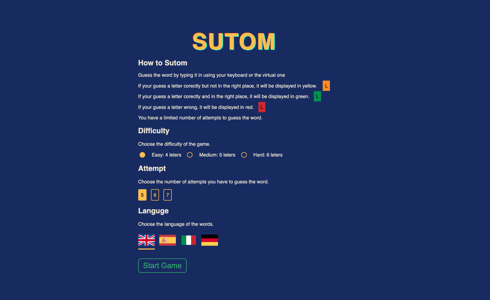
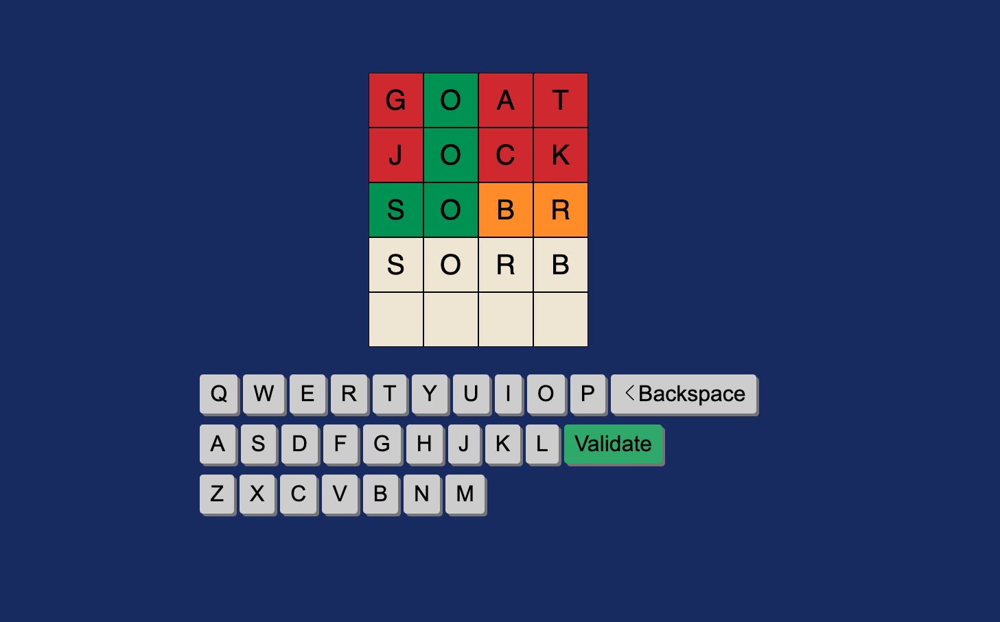

# SUTOM - Word Guessing Game

<!--  <!-- If you have a logo, you can include it here --> -->

## Table of Contents

1. [Description](#description)
2. [Installation](#installation)
3. [Usage](#usage)
4. [Features](#features)
5. [Technologies Used](#technologies-used)
6. [Code Examples](#code-examples)
7. [Project Structure](#project-structure)
8. [Contributing](#contributing)
9. [Acknowledgments](#acknowledgments)
10. [Screenshots/GIFs](#screenshots-gifs)
11. [License](#license)

## Description

SUTOM is a fun word guessing game inspired by the TV show "Limo." The objective of the game is to guess a word within a certain number of attempts. Players can choose the difficulty of the word, the language, and the number of attempts they have to find the word. They can type letters on their keyboard or use the virtual keyboard provided in the app to make their guesses.

## Installation

To run the game on your local machine, follow these steps:

1. Make sure you have [Node.js](https://nodejs.org/) installed.
2. Clone this repository to your local machine.
3. Open your terminal/command prompt and navigate to the project's root directory.
4. Run the following commands:

```bash
npm install
npm run dev
```

The game should now be accessible at http://localhost:5173 in your web browser.

## Usage

1. Launch the game using the instructions provided in the installation section.
2. In the main menu, select the difficulty level, language, and number of attempts for the game.
3. Start guessing the word by typing letters on your keyboard or using the virtual keyboard provided in the app.
4. If you correctly guess the word, a success modal will be displayed. Otherwise, a game over modal will appear.
5. After the game ends, you can choose to start a new game with the same settings or go back to the main menu.
6. If you attempt to submit a word with fewer letters than the target word, a notification will be displayed.

Features
- Choose the difficulty level and language of the word to guess.
- Play the game with a set number of attempts to find the word.
- Interactive virtual keyboard for easier guessing.
- Game Over and Success modals for different game outcomes.

## Technologies Used
- Vite.js
- React.js
- SCSS
- Axios


## Code Examples

The custom hook useGameLoop is the core of the game and manages the game's logic.


```js
import React from 'react'
import axios from 'axios'

import { board } from '../types/board'
import { letter } from '../types/letter'
import { error } from '../types/error'
import { playerWin } from '../types/playerWin'


type StartGame = {
    difficulty: number,
    language: "en" | "es" | "it" | "de",
    attempt: number
}


const useGameLoop = () => {

    const [gameStarted, setGameStarted] = React.useState(false);
    const [currentAttempt, setCurrentAttempt] = React.useState(1);
    const [maxAttempt, setMaxAttempt] = React.useState(5);
    const [currentWord, setCurrentWord] = React.useState('');
    const [board, setBoard] = React.useState<board>([]);
    const [playerWin, setPlayerWin] = React.useState<playerWin>("");
    const [error, setError] = React.useState<error>("");
    const [gameSettings, setGameSettings] = React.useState<StartGame>({
        difficulty: 5,
        language: "en",
        attempt: 5,
    });


    const handleKeyDown = (e: KeyboardEvent) => {
        if (e.key === 'Backspace') {
            playerDel();
        }
        else if (e.key === 'Enter') {
            playerSubmit();
        }
        else if (/^[a-zA-Z]$/.test(e.key)) {
            playerPlay(e.key.toUpperCase());
        }
    }

    const playerPlay = (letter: string) => {
        setBoard((prev: board) => {
            const newBoard = [...prev];
            const row = [...newBoard[currentAttempt - 1]];
            const lastKeyPlayedIndex = row.findIndex((item: letter) => item.letter === '');
            if (lastKeyPlayedIndex !== -1) {
                row[lastKeyPlayedIndex].letter = letter;
                newBoard[currentAttempt - 1] = row;
            }
            return newBoard;
        });
    }

    const playerDel = () => {
        setBoard((prev: board) => {
            const newBoard = [...prev]; // Create a new copy of the board
            const currentRow = newBoard[currentAttempt - 1];
            const lastKeyPlayedIndex = currentRow.findIndex((letter: letter) => letter.letter === '');

            if (lastKeyPlayedIndex !== 0) {
                lastKeyPlayedIndex === -1
                    ? currentRow[currentRow.length - 1].letter = ''
                    : currentRow[lastKeyPlayedIndex - 1].letter = '';

                newBoard[currentAttempt - 1] = currentRow; // Update the corresponding row
            }
            return newBoard;
        });
    }

    const playerSubmit = () => {
        const word = board[currentAttempt - 1].map((letter: letter) => letter.letter).join('');

        if (word.length < currentWord.length) {
            setError(() => "not enouth letters");
            return;
        }
        if (word === currentWord) {
            setPlayerWin(() => "win");
        }
        else {
            const splittedWord = currentWord.split('');
            const row = board[currentAttempt - 1].map((letter, index) => {
                const existedLetterIndex = splittedWord.findIndex((item) => item === letter.letter);
                if (existedLetterIndex !== -1 && index === existedLetterIndex) {
                    splittedWord[existedLetterIndex] = '';
                    letter.isCorrect = "correct";
                }
                else if (existedLetterIndex !== -1 && index !== existedLetterIndex) {
                    splittedWord[existedLetterIndex] = '';
                    letter.isCorrect = "wrong place";
                }
                else {
                    letter.isCorrect = "incorrect";
                }
                return letter;
            })
            setBoard((prev: board) => {
                const newBoard = [...prev];
                newBoard[currentAttempt - 1] = row;
                return newBoard;
            })
            setCurrentAttempt((prev: number) => prev + 1);
        }
    }


    const startGame = async (
        difficulty: number,
        language: "en" | "es" | "it" | "de",
        attempt: number) => {

        const url = `https://random-word-api.herokuapp.com/word`;
        const params: { "length": number, "lang"?: string } = { "length": difficulty };
        if (language !== "en") params['lang'] = language;
        const { data } = await axios.get(url, {
            params: params
        });
        console.log(data);
        setCurrentWord(() => data[0].toUpperCase());
        const wordLength = data[0].length;
        const newBoard: board = Array.from({ length: attempt }, () =>
            Array.from({ length: wordLength }, () => ({ letter: '', isCorrect: "unset" }))
        );
        setMaxAttempt(() => attempt);
        setBoard(() => newBoard);
        setGameStarted(() => true);
        setGameSettings(() => ({ difficulty, language, attempt }));
    }

    const restartGame = () => {
        setCurrentAttempt(() => 1);
        setBoard(() => []);
        setPlayerWin(() => "");
        startGame(gameSettings.difficulty, gameSettings.language, gameSettings.attempt);
    }

    const stopGame = () => {
        setCurrentAttempt(() => 1);
        setBoard(() => []);
        setPlayerWin(() => "");
        setGameStarted(() => false);
    }


    React.useEffect(() => {
        if (gameStarted) {
            window.addEventListener('keydown', handleKeyDown);
            return () => {
                window.removeEventListener('keydown', handleKeyDown);
            }
        }
    }, [gameStarted, handleKeyDown]);

    React.useEffect(() => {
        if (currentAttempt > maxAttempt) {
            setPlayerWin(() => "lose");
        }
    }, [currentAttempt, maxAttempt]);

    React.useEffect(() => {
        setError(() => "");
    }, [error])

    return {
        gameStarted,
        startGame,
        board,
        playerPlay,
        playerDel,
        setCurrentAttempt,
        playerSubmit,
        playerWin,
        error,
        wordLength: currentWord.length,
        restartGame,
        stopGame
    }
}

export default useGameLoop
```

## Project Structure

The project structure is organized as follows:

SUTOM/
|-- Game/
|   |-- index.tsx
|   |-- useGameLoop.tsx
|-- Menu/
|   |-- index.tsx
|-- Keyboard/
|   |-- index.tsx
|-- Board/
|   |-- index.tsx
|-- ...


- Game/: Contains the main game component and the custom hook useGameLoop for managing game logic.
- Menu/: Contains the menu component for selecting game options.
- Keyboard/: Contains the virtual keyboard component for user interaction.
- Board/: Contains the board component for displaying the word typed by the user.


## Screenshots





